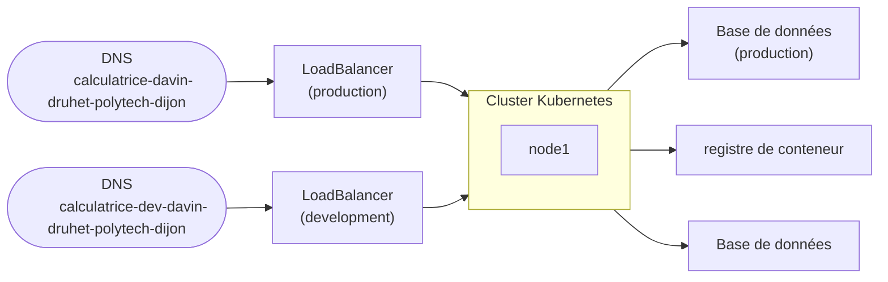

# Partie Terraform

Voici le schéma réalisé dans cette partie.



## Fichier `provider.tf`

Dans ce fichier, on a défini le provider, ici **Scaleway** et la zone, ici `fr-par-2` (:flag_france:).  

## Fichier `variables.tf`

Dans ce fichier, on a défini plusieurs variables :
- `project_id` : L'identifiant du projet chez **Scaleway**
- `database_user_prod` : L'identifiant de l'administrateur de la base de données de production
- `database_password_prod` : Le mot de passe de l'administrateur de la base de données de production
- `database_user_dev` : L'identifiant de l'administrateur de la base de données de développement
- `database_password_dev` : Le mot de passe de l'administrateur de la base de données de développement
- `database_name` : Le nom de la base de données

## Fichier `main.tf`

Au début du fichier, on dit à Terraform d'utiliser le module **Scaleway**.

Maintenant, voici un tableau des ressources et de leur utilité : 

|        Type de resource        |      Nom de resource      |                                                     Explication                                                     |
|:------------------------------:|:-------------------------:|:-------------------------------------------------------------------------------------------------------------------:|
|         `scaleway_vpc`         |           `vpc`           |                                               Création du réseau privé                                              |
|     `scaleway_k8s_cluster`     |       `calc_cluster`      |                                            Création du cluster Kubernetes                                           |
|       `scaleway_k8s_pool`      |        `calc_pool`        |                                            Création de le pool Kubernetes                                           |
|     `scaleway_instance_ip`     |   `calc_public_ip_prod`   |                           Attribution d'une adresse IP publique pour la partie Production                           |
|     `scaleway_instance_ip`     |    `calc_public_ip_dev`   |                          Attribution d'une adresse IP publique pour la partie Développement                         |
|          `scaleway_lb`         | `calc_load_balancer_prod` |        Création d'un Load Balancer et attribution de l'adresse IP publique de production comme point d'entrée       |
|          `scaleway_lb`         |  `calc_load_balancer_dev` |      Création d'un Load Balancer et attribution de l'adresse IP publique de développement comme point d'entrée      |
|    `scaleway_domain_record`    |       `calc_dns_dev`      | Création d'un enregistrement DNS de type A qui met en cible l'adresse IP de développement de l'URL de développement |
|    `scaleway_domain_record`    |      `calc_dns_prod`      |   Création d'un enregistrement DNS de type A qui met en cible l'adresse IP de développement de l'URL de production  |
|     `scaleway_rdb_database`    |     `db-database-prod`    |                     Création d'une machine pour accueillir la base de données pour la production                    |
|     `scaleway_rdb_database`    |     `db-database-dev`     |                   Création d'une machine pour accueillir la base de données pour le développement                   |
|     `scaleway_rdb_instance`    |     `db-instance-prod`    |          Création de l'instance de la base de données de production (ici on a mis PostgreSQL en version 15)         |
|     `scaleway_rdb_instance`    |     `db-instance-dev`     |        Création de l'instance de la base de données de développement (ici on a mis PostgreSQL en version 15)        |
| `scaleway_regisgtry_namespace` | `calc_container_registry` |                                          Création du registre de conteneurs                                         |

_idée de tableau inspiré par le BG Arno BIDET (@ArnoBIDET)_.  

Maintenant, voici la sortie de Terraform : 

```
Terraform used the selected providers to generate the following execution plan. Resource actions are indicated with the following symbols:
  + create

Terraform will perform the following actions:

  # scaleway_domain_record.calc_dns_dev will be created
  + resource "scaleway_domain_record" "calc_dns_dev" {
      + data            = (known after apply)
      + dns_zone        = "kiowy.net"
      + fqdn            = (known after apply)
      + id              = (known after apply)
      + keep_empty_zone = false
      + name            = "calculatrice-dev-davin-druhet-polytech-dijon"
      + priority        = (known after apply)
      + project_id      = (known after apply)
      + root_zone       = (known after apply)
      + ttl             = 3600
      + type            = "A"
    }

  # scaleway_domain_record.calc_dns_prod will be created
  + resource "scaleway_domain_record" "calc_dns_prod" {
      + data            = (known after apply)
      + dns_zone        = "kiowy.net"
      + fqdn            = (known after apply)
      + id              = (known after apply)
      + keep_empty_zone = false
      + name            = "calculatrice-davin-druhet-polytech-dijon"
      + priority        = (known after apply)
      + project_id      = (known after apply)
      + root_zone       = (known after apply)
      + ttl             = 3600
      + type            = "A"
    }

  # scaleway_instance_ip.calc_public_ip_dev will be created
  + resource "scaleway_instance_ip" "calc_public_ip_dev" {
      + address         = (known after apply)
      + id              = (known after apply)
      + organization_id = (known after apply)
      + prefix          = (known after apply)
      + project_id      = (known after apply)
      + reverse         = (known after apply)
      + server_id       = (known after apply)
      + type            = (known after apply)
      + zone            = (known after apply)
    }

  # scaleway_instance_ip.calc_public_ip_prod will be created
  + resource "scaleway_instance_ip" "calc_public_ip_prod" {
      + address         = (known after apply)
      + id              = (known after apply)
      + organization_id = (known after apply)
      + prefix          = (known after apply)
      + project_id      = (known after apply)
      + reverse         = (known after apply)
      + server_id       = (known after apply)
      + type            = (known after apply)
      + zone            = (known after apply)
    }

  # scaleway_k8s_cluster.calc_cluster will be created
  + resource "scaleway_k8s_cluster" "calc_cluster" {
      + apiserver_url               = (known after apply)
      + cni                         = "cilium"
      + created_at                  = (known after apply)
      + delete_additional_resources = false
      + id                          = (known after apply)
      + kubeconfig                  = (sensitive value)
      + name                        = "calc-cluster"
      + organization_id             = (known after apply)
      + private_network_id          = (known after apply)
      + project_id                  = (known after apply)
      + region                      = (known after apply)
      + status                      = (known after apply)
      + type                        = (known after apply)
      + updated_at                  = (known after apply)
      + upgrade_available           = (known after apply)
      + version                     = "1.29.1"
      + wildcard_dns                = (known after apply)

      + auto_upgrade (known after apply)

      + autoscaler_config (known after apply)

      + open_id_connect_config (known after apply)
    }

  # scaleway_k8s_pool.calc_pool will be created
  + resource "scaleway_k8s_pool" "calc_pool" {
      + autohealing            = false
      + autoscaling            = false
      + cluster_id             = (known after apply)
      + container_runtime      = "containerd"
      + created_at             = (known after apply)
      + current_size           = (known after apply)
      + id                     = (known after apply)
      + max_size               = (known after apply)
      + min_size               = 1
      + name                   = "calc-pool"
      + node_type              = "DEV1-M"
      + nodes                  = (known after apply)
      + public_ip_disabled     = false
      + region                 = (known after apply)
      + root_volume_size_in_gb = (known after apply)
      + root_volume_type       = (known after apply)
      + size                   = 1
      + status                 = (known after apply)
      + updated_at             = (known after apply)
      + version                = (known after apply)
      + wait_for_pool_ready    = true
      + zone                   = (known after apply)

      + upgrade_policy (known after apply)
    }

  # scaleway_lb.calc_load_balancer_dev will be created
  + resource "scaleway_lb" "calc_load_balancer_dev" {
      + id                      = (known after apply)
      + ip_address              = (known after apply)
      + ip_id                   = (known after apply)
      + ip_ids                  = [
          + (known after apply),
        ]
      + ipv6_address            = (known after apply)
      + name                    = "calc-lb-dev"
      + organization_id         = (known after apply)
      + project_id              = (known after apply)
      + region                  = (known after apply)
      + ssl_compatibility_level = "ssl_compatibility_level_intermediate"
      + type                    = "LB-S"
      + zone                    = (known after apply)

      + private_network {
          + dhcp_config        = (known after apply)
          + ipam_ids           = (known after apply)
          + private_network_id = (known after apply)
          + static_config      = []
          + status             = (known after apply)
          + zone               = (known after apply)
        }
    }

  # scaleway_lb.calc_load_balancer_prod will be created
  + resource "scaleway_lb" "calc_load_balancer_prod" {
      + id                      = (known after apply)
      + ip_address              = (known after apply)
      + ip_id                   = (known after apply)
      + ip_ids                  = [
          + (known after apply),
        ]
      + ipv6_address            = (known after apply)
      + name                    = "calc-lb-prod"
      + organization_id         = (known after apply)
      + project_id              = (known after apply)
      + region                  = (known after apply)
      + ssl_compatibility_level = "ssl_compatibility_level_intermediate"
      + type                    = "LB-S"
      + zone                    = (known after apply)

      + private_network {
          + dhcp_config        = (known after apply)
          + ipam_ids           = (known after apply)
          + private_network_id = (known after apply)
          + static_config      = []
          + status             = (known after apply)
          + zone               = (known after apply)
        }
    }

  # scaleway_rdb_database.db-database-dev will be created
  + resource "scaleway_rdb_database" "db-database-dev" {
      + id          = (known after apply)
      + instance_id = (known after apply)
      + managed     = (known after apply)
      + name        = "database"
      + owner       = (known after apply)
      + region      = (known after apply)
      + size        = (known after apply)
    }

  # scaleway_rdb_database.db-database-prod will be created
  + resource "scaleway_rdb_database" "db-database-prod" {
      + id          = (known after apply)
      + instance_id = (known after apply)
      + managed     = (known after apply)
      + name        = "database"
      + owner       = (known after apply)
      + region      = (known after apply)
      + size        = (known after apply)
    }

  # scaleway_rdb_instance.db-instance-dev will be created
  + resource "scaleway_rdb_instance" "db-instance-dev" {
      + backup_same_region        = (known after apply)
      + backup_schedule_frequency = (known after apply)
      + backup_schedule_retention = (known after apply)
      + certificate               = (known after apply)
      + disable_backup            = false
      + encryption_at_rest        = true
      + endpoint_ip               = (known after apply)
      + endpoint_port             = (known after apply)
      + engine                    = "PostgreSQL-15"
      + id                        = (known after apply)
      + is_ha_cluster             = true
      + name                      = "db-instance-dev"
      + node_type                 = "DB-DEV-S"
      + organization_id           = (known after apply)
      + password                  = (sensitive value)
      + project_id                = (known after apply)
      + read_replicas             = (known after apply)
      + region                    = (known after apply)
      + settings                  = (known after apply)
      + user_name                 = "admin_dev"
      + volume_size_in_gb         = (known after apply)
      + volume_type               = "lssd"

      + load_balancer (known after apply)

      + logs_policy (known after apply)

      + private_network {
          + enable_ipam = (known after apply)
          + endpoint_id = (known after apply)
          + hostname    = (known after apply)
          + ip          = (known after apply)
          + ip_net      = (known after apply)
          + name        = (known after apply)
          + pn_id       = (known after apply)
          + port        = (known after apply)
          + zone        = (known after apply)
        }
    }

  # scaleway_rdb_instance.db-instance-prod will be created
  + resource "scaleway_rdb_instance" "db-instance-prod" {
      + backup_same_region        = (known after apply)
      + backup_schedule_frequency = (known after apply)
      + backup_schedule_retention = (known after apply)
      + certificate               = (known after apply)
      + disable_backup            = false
      + encryption_at_rest        = true
      + endpoint_ip               = (known after apply)
      + endpoint_port             = (known after apply)
      + engine                    = "PostgreSQL-15"
      + id                        = (known after apply)
      + is_ha_cluster             = true
      + name                      = "db-instance-prod"
      + node_type                 = "DB-DEV-S"
      + organization_id           = (known after apply)
      + password                  = (sensitive value)
      + project_id                = (known after apply)
      + read_replicas             = (known after apply)
      + region                    = (known after apply)
      + settings                  = (known after apply)
      + user_name                 = "admin"
      + volume_size_in_gb         = (known after apply)
      + volume_type               = "lssd"

      + load_balancer (known after apply)

      + logs_policy (known after apply)

      + private_network {
          + enable_ipam = (known after apply)
          + endpoint_id = (known after apply)
          + hostname    = (known after apply)
          + ip          = (known after apply)
          + ip_net      = (known after apply)
          + name        = (known after apply)
          + pn_id       = (known after apply)
          + port        = (known after apply)
          + zone        = (known after apply)
        }
    }

  # scaleway_registry_namespace.calc-container-registry will be created
  + resource "scaleway_registry_namespace" "calc-container-registry" {
      + endpoint        = (known after apply)
      + id              = (known after apply)
      + is_public       = false
      + name            = "calc-container-registry"
      + organization_id = (known after apply)
      + project_id      = (known after apply)
      + region          = (known after apply)
    }

  # scaleway_vpc.vpc will be created
  + resource "scaleway_vpc" "vpc" {
      + created_at      = (known after apply)
      + enable_routing  = (known after apply)
      + id              = (known after apply)
      + is_default      = (known after apply)
      + name            = "calc-vpc"
      + organization_id = (known after apply)
      + project_id      = (known after apply)
      + region          = (known after apply)
      + tags            = [
          + "demo",
          + "terraform",
        ]
      + updated_at      = (known after apply)
    }

Plan: 14 to add, 0 to change, 0 to destroy.

────────────────────────────────────────────────────────────────────────────────────────────────────────────────────────────────────────────────── 

Note: You didn't use the -out option to save this plan, so Terraform can't guarantee to take exactly these actions if you run "terraform apply"    
now.
```
